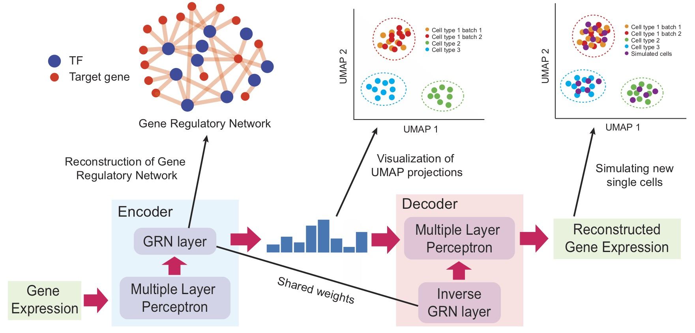

# DeepSEM

## About
This directory contains the code and resources of the following paper:

<i>"" </i>


## Overview of the Model
We introduce DeepSEM,  a deep-learning-based approach with novel neural network architecture that can infer gene regulatory network, embed single cell, augmente biological feasible single-cell RNA-seq expression data by interpreting different modules using the same model.

<p align="center">
 
</p>


## Dependencies 
- python 3.7
- pytorch==1.2.0
- scanpy==1.6.0
- numpy==1.14.5
- pandas==0.17.1
- scikit-learn==0.23.2


##  Useage
### 1. Gene Regulation Inference
- Data Preparation 
   1. Download data from https://doi.org/10.5281/zenodo.3378975, provided by BEELINE benchmark
   2. Use the preoprocess code https://github.com/Murali-group/Beeline/blob/master/generateExpInputs.py to generate 
   dataset.The preprocessed data is shown in data/
- Train 
   1. For cell-type non specific ground truth (STRING, cell-type Non specific ChIP-seq) 
   ```sh
    python main.py --task non_celltype_GRN --data_file <scGNA-seq path>  --net_file  <Ground Truth path>
    python main.py --task non_celltype_GRN --data_file data/GRN_inference/1000_STRING_mHSC-GM/data.csv  --net_file  data/GRN_inference/1000_STRING_mHSC-GM/label.csv
    ```
   2. For cell-type specific ground truth ( cell-type specific ChIP-seq, lof/gof)
    ```sh
    python main.py --task celltype_GRN --data_file <scGNA-seq path>  --net_file  <Ground Truth path>
    python main.py --task celltype_GRN --data_file data/GRN_inference/1000_ChIP-seq_mHSC-GM/data.csv --net_file data/GRN_inference/1000_ChIP_seq_mHSC-GM/label.csv
    ```
- Evaluate
    Evaluate can be done by BEELINE benchmark(https://github.com/Murali-group/Beeline/blob/master/BLEvaluator.py), src/utils.py also provide the code to calculate EPR score. 
### 2. scRNA-seq expression Simulation
- Data Preparation
    1. Download data from https://support.10xgenomics.com/single-cell-gene-expression/datasets/1.1
    .0/fresh_68k_pbmc_donor_a, and use the preprocess code in ipynb/
    The preprocessed data is shown in data/preprocess_PBMC_dataset.ipynb
- Simulation  
    ```sh
    run python main.py --task generate --data_file <scRNA-seq path>
    run python main.py --task generate --data_file data/Generation/CD14+_data.csv
   ```
#### 3. Embedding 
- Data Preparation
    - Zeisel \
        1. Download original data from https://storage.googleapis
        .com/linnarsson-lab-www-blobs/blobs/cortex/expression_mRNA_17-Aug-2014.txt
        2. Preprocess use code in ipynb/preprocess_embed_data.ipynb
        3. Preprocessed data and output from DeepSEM are shown in data/Embedding/
    - Marouf 
        1. Download scRNA-seq data and annotation following ipynb/preprocess_embed_data.ipynb
        2. Preprocess use code in ipynb/preprocess_embed_data.ipynb
        3. Preprocessed data and output from DeepSEM are shown in data/Embedding/
    dataset is shown in data/
- Embedding 
    ```sh
    run python main.py --task embedding --data_file <scRNA-seq path>
    run python main.py --task embedding --data_file data/Embedding/Zeisel_data.csv
    ```

#Other single-cell RNA-seq package 
- BEELINE   https://github.com/Murali-group/Beeline
- scVI  https://github.com/romain-lopez/scVI-reproducibility
- DCA   https://github.com/theislab/dca
- ZIFA  https://github.com/epierson9/ZIFA
- scGAN/cscGAN  https://github.com/imsb-uke/scGAN

If you have any question, please feel free to contact to me. \
Email: sht18@mails.tsinghua.edu.cn, shuht96@gmail.com
## License
DeepSEM is licensed under the Apache License, Version 2.0: http://www.apache.org/licenses/LICENSE-2.0


